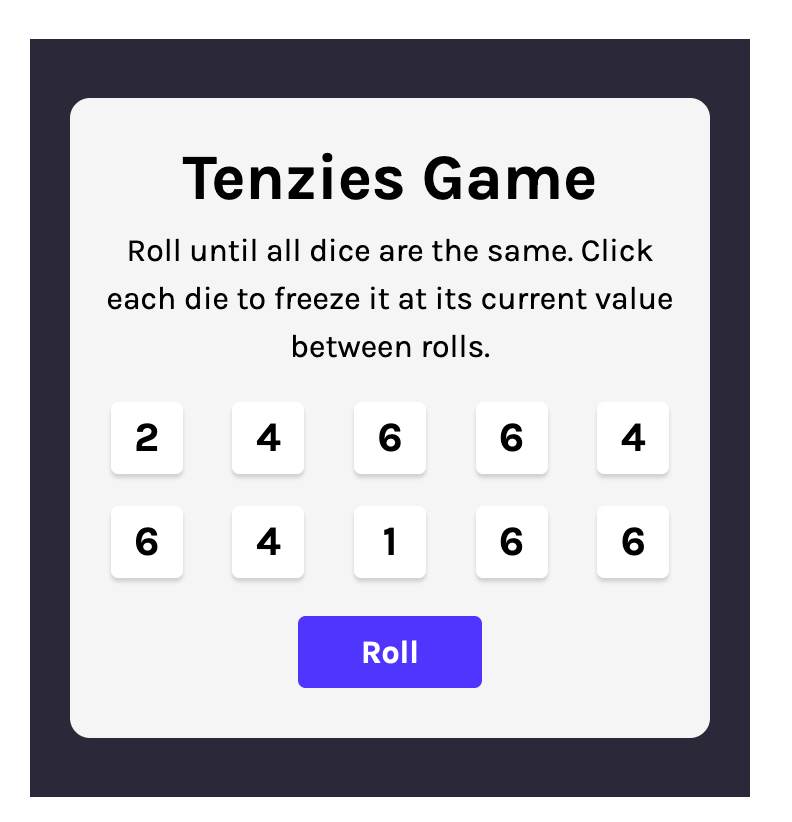

# Scrimba React Basics Project

### [Live Version](https://rapidisimo.github.io/Tenzies/)

## My Objectives
Understand the lessons and produce the same work outside of the Scrimba editor in my local VSCode enviroment.

## Stretch Goals
Add additional features to the game on my own.
Examples:
- Dots on dice via CSS instead of digits
- Track the number of rolls
- Track the time it took to win
- Save data to local storage: Time and number or Rolls

## Requirements
1. Solve the challenges on my own and produce working version of the game.

## Preview

